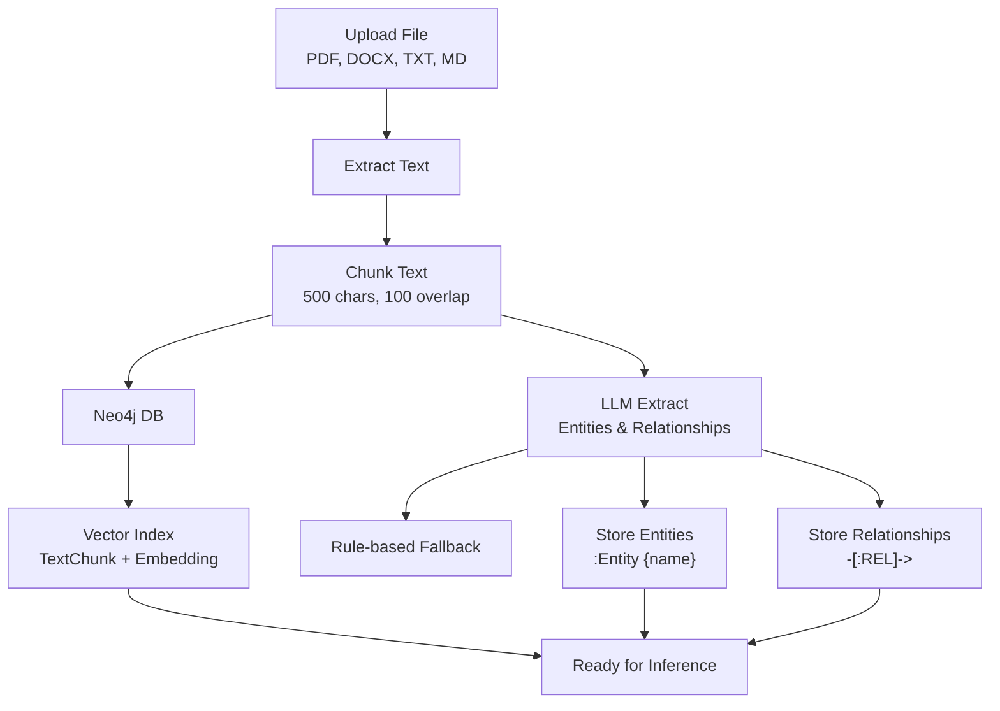

# Hybrid Graph RAG – File Upload + Knowledge Graph + Vector Search

**Upload any document (PDF, DOCX, TXT, MD) → Build a knowledge graph → Ask questions in plain English.**

[](https://colab.research.google.com/github/<your-username>/genai-rag-neo4j-langchain-groq-demo/blob/main/rag_demo.ipynb)
[](https://python.org)
[](https://python.langchain.com)
[](https://neo4j.com/cloud/aura/)
[](https://console.groq.com)

> **Guarantees**  
> - Embeddings and its text chunks **are stored** (not just embeddings)  
> - **Nodes and its Relationships always created for unstructured data well** (LLM + fallback)  
> - Works with **PDF, DOCX, TXT**  
> - User can Questions and get Answers in **clean, plain English**

---

## Features
- File upload: `.pdf`, `.docx`, `.txt`
- Stores **text + embeddings along with nodes and its relationships** in Neo4j
- Knowledge Graph for Enhanced Contextual Accuracy 
- Extracts **entities & relationships** (LLM + fallback)
- Semantic search via vector index
- Fast answers with **Groq Llama 3.3 70B**
- Runs in **Colab** or **locally**

---

## Prerequisites

| Requirement       | How to Get |
|-------------------|------------|
| **Groq API Key**  | [console.groq.com](https://console.groq.com) |
| **Neo4j AuraDB**  | [console.neo4j.io](https://console.neo4j.io) |
| **Python 3.10+**  | Local or Colab |

> No GPU needed.

---

## Run in Google Colab

1. Click:  
   [](https://colab.research.google.com/github/<your-username>/genai-rag-neo4j-langchain-groq-demo/blob/main/rag_demo.ipynb)

2. Run all cells → enter:
   - `Groq API key`
   - `Neo4j URI` (`neo4j+s://<id>.databases.neo4j.io`)
   - `Username`: `neo4j`
   - `Password`
3. Upload file → **Choose Files**
4. Wait for: `Vectors stored`, `X relationships stored`
5. Start asking questions!

> **Tip:** The graph persists in Neo4j — close and reopen later.

---

## Architecture

### Data Ingestion Flow

### Data Inferance Flow 

```mermaid
graph TD
    A["When the prompt opens"] --> B[Text Promt Opens]
    B --> C["Ask any questions in plain English"]
    C --> D["you may get answer if the questions are relevent to the data in ingested"]
    D --> E["Get Answer in Plain English"]
    E --> J[When Done. 'quit' to terminate]
